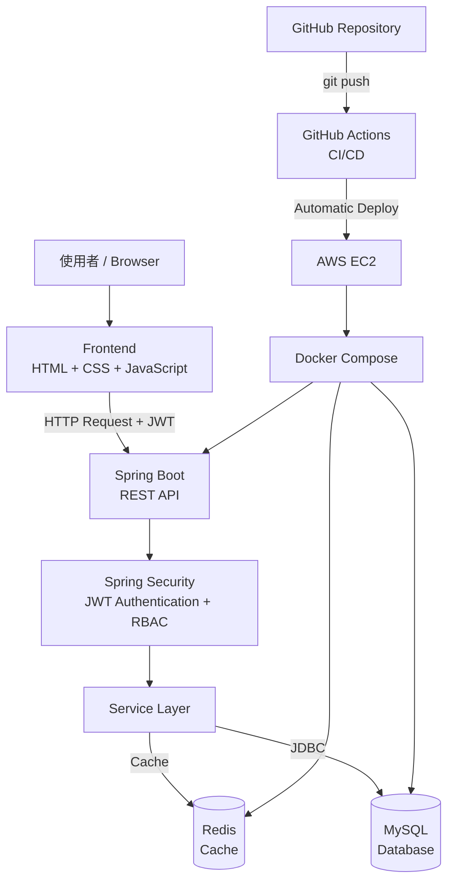

# Member Management System

以 Spring Boot 開發的會員管理系統，實作 RESTful API、JWT 身分驗證、RBAC 角色權限控制、Redis 快取、Docker 容器化，以及 AWS EC2 雲端部署與 GitHub Actions CI/CD。

除了後端 API，也使用 HTML、CSS、JavaScript 製作簡易管理介面，可實際進行登入與會員資料管理。

---

## Features

### 會員管理
- 新增會員
- 查詢會員
- 修改會員
- 刪除會員
- 會員狀態管理
- 分頁查詢
- 姓名搜尋

### Authentication
- 使用者註冊
- 使用者登入
- BCrypt 密碼加密
- JWT Token 驗證

### RBAC 權限控制

系統區分兩種角色：

| 功能 | USER | ADMIN |
|---|---|---|
| 查詢會員 | ✅ | ✅ |
| 新增會員 | ❌ | ✅ |
| 修改會員 | ❌ | ✅ |
| 刪除會員 | ❌ | ✅ |

後端使用 Spring Security 驗證角色權限，並非僅透過前端隱藏功能。

### Redis Cache
- 使用 Redis 快取會員列表
- `@Cacheable` 建立快取
- `@CacheEvict` 在資料異動後清除舊快取
- Cache TTL：10 分鐘

### Frontend
使用：
- HTML
- CSS
- JavaScript

提供：
- 登入頁
- JWT 登入
- 會員列表
- ADMIN 新增會員
- ADMIN 刪除會員
- USER 唯讀介面

---

## Tech Stack

### Backend
- Java
- Spring Boot
- Spring Security
- Spring Data Redis
- JDBC
- Maven

### Database
- MySQL 8.4

### Cache
- Redis 7.4

### DevOps / Cloud
- Docker
- Docker Compose
- AWS EC2
- GitHub Actions
- CI/CD

### API Documentation
- Swagger / OpenAPI

### Frontend
- HTML
- CSS
- JavaScript

---

## System Architecture

Frontend
↓
Spring Boot REST API
↓
Spring Security
↓
JWT Authentication + RBAC
↓
Service Layer
↓
Redis Cache / MySQL
↓
Docker
↓
AWS EC2

GitHub Push
↓
GitHub Actions
↓
SSH EC2
↓
Docker Build & Deploy

---

## Redis Cache Flow

第一次查詢會員：

GET /api/members
↓
Spring Boot
↓
MySQL
↓
Redis Cache

再次查詢：

GET /api/members
↓
Redis Cache
↓
Response

會員資料新增、修改或刪除：

POST / PUT / DELETE
↓
更新 MySQL
↓
清除 Redis Cache
↓
下次 GET 重新建立 Cache

---

## CI/CD

當程式碼 Push 至 GitHub `main` branch：

1. GitHub Actions 自動啟動
2. SSH 連線至 AWS EC2
3. Pull 最新程式碼
4. Docker Compose Build
5. 自動重新部署應用程式

---

## Security

- BCrypt Password Hashing
- JWT Authentication
- Spring Security
- RBAC Authorization
- Stateless Authentication
- GitHub Secrets 管理部署憑證
- `.env` 不提交至 Git Repository

---

## Future Improvements

- 完善會員編輯介面
- Refresh Token
- Redis 更細緻的 Cache Strategy
- Unit / Integration Test 擴充
- HTTPS + Domain
- 改善 CI/CD 部署安全性

---

### 專案架構圖

      
